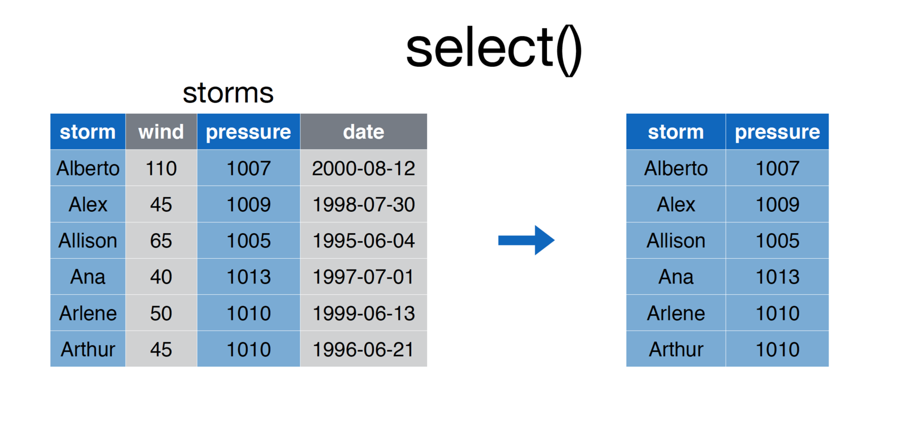
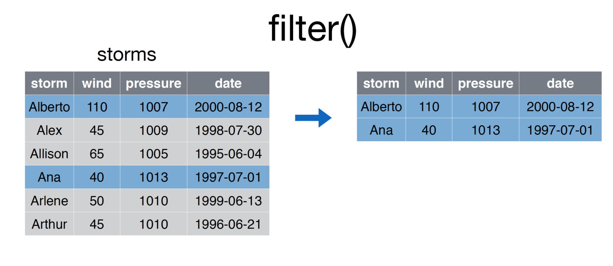
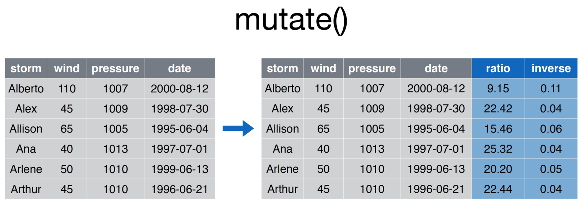
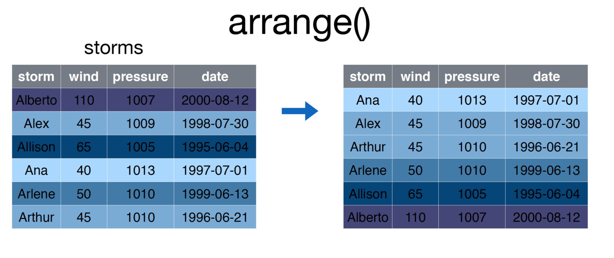
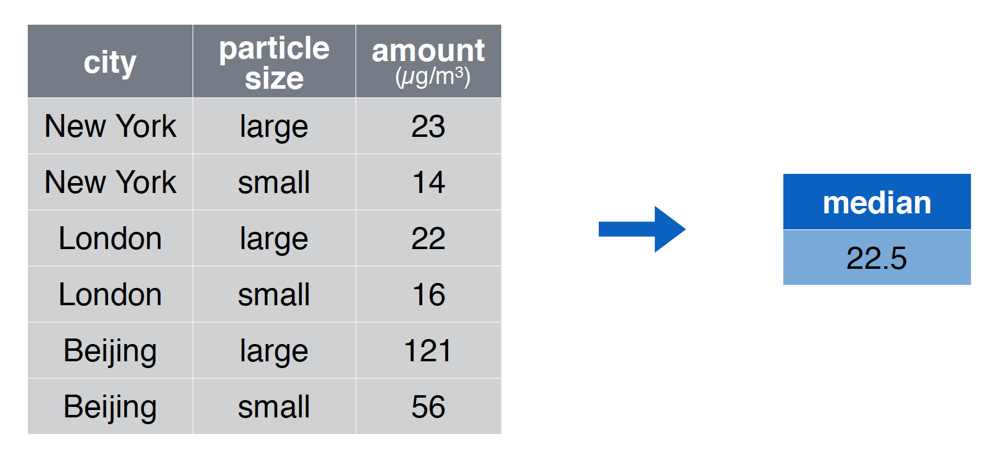
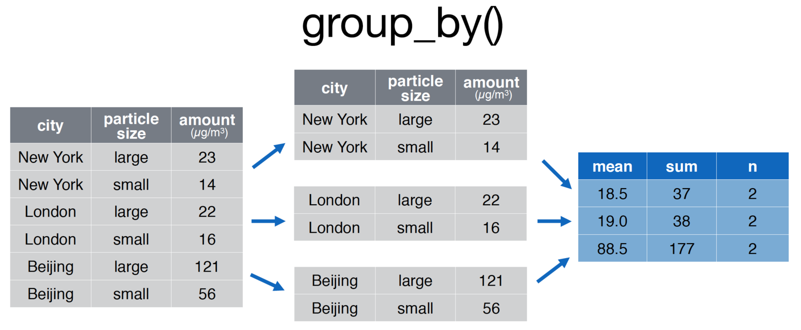

# Module 9: Introduction to the DPLYR Package

## Overview
The DPLYR package is the preeminent tool for data wrangling in R (and perhaps, in data science more generally). It provides users with an intuitive vocabulary for executing data management and analysis tasks. Learning this package will undoubtedly make your data preparation and management process faster and easier to understand.

<!-- START doctoc generated TOC please keep comment here to allow auto update -->
<!-- DON'T EDIT THIS SECTION, INSTEAD RE-RUN doctoc TO UPDATE -->
**Contents**

- [Resources](#resources)
- [A Grammar of Data Manipulation](#a-grammar-of-data-manipulation)
- [Data Frame Manipulation](#data-frame-manipulation)
  - [Select](#select)
  - [Filter](#filter)
  - [Mutate](#mutate)
  - [Arrange](#arrange)
  - [Summarise](#summarise)
  - [Distinct](#distinct)
- [Pipe Operator](#pipe-operator)
  - [Nested Operations](#nested-operations)
  - [Pipe Operator Syntax](#pipe-operator-syntax)
- [Grouped Operations](#grouped-operations)
- [Joins](#joins)
  - [DPLYR Joins,](#dplyr-joins)
- [Non-standard Evaluation](#non-standard-evaluation)

<!-- END doctoc generated TOC please keep comment here to allow auto update -->

## Resources
- [Introduction to DPLYR - RStudio](https://cran.rstudio.com/web/packages/dplyr/vignettes/introduction.html)
- [STRATA NYC Materials Download - RStudio](bit.ly/rday-nyc-strata15)
- [Non-standard Evaluation in DPLYR - RStudio](https://cran.r-project.org/web/packages/dplyr/vignettes/nse.html)
- [Data Manipulation with DPLYR - R-bloggers](https://www.r-bloggers.com/data-manipulation-with-dplyr/)
- [Data Manipulation in R - DataCamp](https://www.datacamp.com/courses/dplyr-data-manipulation-r-tutorial)
- [DPLYR Join Cheatsheet - Jenny Bryan](http://stat545.com/bit001_dplyr-cheatsheet.html)
- [Two-Table Verbs - CRAN](https://cran.r-project.org/web/packages/dplyr/vignettes/two-table.html)

## A Grammar of Data Manipulation
[Hadley Wickham](http://hadley.nz/), the creator of the dplyr package, fittingly refers to it as a _Grammar of Data Manipulation_. The package provides a set of verbs to execute common data preparation tasks. One of the core challenge in programming is mapping from questions about a dataset to specific programming operations. The presence of a data manipulation grammar makes this process smoother, as it enables us to use the same vocabulary to both ask questions and execute our program. More specifically, it allows us to:

- `select` specific columns of interest
- `filter` down the rows
- `mutate` a dataset to add more columns
- `arrange` your rows in a particular order
- `summarise` columns of interest
- `distinct` - select the `distinct` set of rows
- `join` multiple `data.frame` elements together

As you know, it's possible to implement any of these procedures with base R code -- this library just makes it easier to read and write. In the next section, we'll learn how to implement these functions to ask questions of our datasets.

To practice asking questions about datasets _without_ `dplyr`, see [exercise-1](exercise-1).

## Data Frame Manipulation
Many real-world questions about a dataset boil down to isolating specific rows/columns of the data and performing a simple comparison or computation (mean, median, etc.). Making yourself comfortable with the following operations will allow you to quickly write code to ask questions of your dataset.

For each of the following `dplyr` functions, the first argument to the function is a data frame, followed by various other arguments. Note, inside of the `dplyr` function parenthases, you should reference data frame columns **without quotation marks** (see examples below). This design choice makes the code easier to write and read, though occasionally can create challenges. To learn more, see the section below on [Non-standard Evaluation](#Non-standard Evaluation).


The images in this section come from the [RStudio STRATA NYC Materials](bit.ly/rday-nyc-strata15), which was presented by [Nathan Stephens](http://conferences.oreilly.com/strata/big-data-conference-ny-2015/public/schedule/speaker/217840). Exercises 4, 5, and 6 inspired by the RStudio [documentation](https://cran.rstudio.com/web/packages/dplyr/vignettes/introduction.html).

### Select
The `select` operation allows you to choose the **columns** of interest out of your data frame.



To execute the `select` function, simply pass in the data frame, and the names of the columns you wish to `select`:

```r
# Select `storm` and `pressure` columns from `storms` data frame
storms <- select(storms, storm, pressure)
```

### Filter
Whereas `select` allows you to focus in on **columns** of interest, the `filter` function allows you to hone in on **rows** of interest. For example:



```r
# Select storms whose `storm` column is in the vector ['Ana', 'Alberto']
some.storms <- filter(storms, storm %in% c('Ana', 'Alberto')
```

After passing in a data frame as the first argument of the function, you may specify a series of comma-separated **conditions**:

```r
# Generic form of the `filter` function
filtered.rows <- filter(DATAFRAME, CONDITION-1, CONDITION-2, ..., CONDITION-N)
```
 R will return all rows that match **all** condition. This is similar to saying that you want to `filter` down a dataframe to only the rows that meet condition-1 **and** condition-2.

### Mutate
The `mutate` function allows you to create additional **columns** for your data frame:



```r
# Add ratio and inverse ratio columns
storms <- mutate(storms, ratio = pressure/wind, inverse = 1/ratio
```

As always, the first **argument** to the function is that data frame with which you are working. Each additional argument is a statement that creates a new **column** using the following syntax:

```r
# Generic form of the `mutate` function
more.columns <- mutate(DATAFRAME, new.column1 = old.column * 2, new.column2 = old.column * 3 )
```

In cases where you creating multiple variables (and therefore writing really long lines of code), you should break the single statement into multiple lines.

```r
# Generic form of the `mutate` function
more.columns <- mutate(DATAFRAME,
                       new.column1 = old.column * 2,
                       new.column2 = old.column * 3,
                       new.column3 = old.column * 4
                      )
```


### Arrange
The `arrange` function is what you may think of as **sorting rows**.



```r
# Arrange storms by increasing order of the `wind` column
storms <- arrange(storms, wind)
```

To sort by the **reverse** order of a column, simply place a minus sign (`-`) preceeding the varaible name. As you might imagine, you can pass multiple arguments into the `arrange` function to sort first by `argument-1`, then by `argument-2`.

### Summarise
The `summarise` function (`summarize` is also accepted) creates a summary of a **column**, computing a single value from multipe values. The `summarise` function is particularly useful for grouped operations (see below), however can be used in non-grouped operations as well, for example:



```r
# Compute the median value of the `amount` column
summary <- summarise(pollution, median = median(amount))
```

Each argument following the name of your data frame is a new value that will be computed using your columns. As you likely guessed, you can computed multiple summaries in the same statement:

```r
# Compute the median value of the `amount` column
summaries <- summarise(pollution,
                       median = median(amount),
                       mean = mean(amount),
                       sum = sum(amount),
                       count = n() # nifty trick for number of observations
                       )
```

### Distinct
The `distinct` function allows you to extract only the distinct **rows** in a table, evaluated based on the **columns** provided as arguments to the function. For example:

```r
# Create a quick data frame
x <- c(1, 1, 2, 2, 3, 3, 4, 4)
y <- 1:8
my.df <- data.frame(x, y)

# Select distinct rows, judging by the `x` column
distinct.rows <- distinct(my.df, x)

# Select distinct rows, judging by the `x` and `y`columns
distinct.rows <- distinct(my.df, x, y)
```

While this is a simple way to get a unique set of rows, **be careful** not to unintentionally remove rows of your data which may be important.

To practice asking questions about datasets _with_ `dplyr`, see [exercise-2](exercise-2). For a more involved example, see [exercise-4](exercise-4).

## Pipe Operator
You've likely encountered a number of instances in which you want to take the results from one function and pass them into another function. Our approach thus far has often been to create temporary variables for use in our analysis. For example, if you're using the `mtcars` dataset, you may want to ask a simple question like,

> Which 4-cylinder car gets the best milage per gallon?

This simple question actually requires a few steps:

1. `Filter` down the dataset to only 4 cylinder cars
2. Of the 4 cylinder cars, `filter` down to the one with the highest mpg
3. `Select` the car name of the car from step 2.

You could then implement each step as follows:

```r
# Add a column that is the car name
mtcars.named <- mutate(mtcars, car.name = row.names(mtcars))

# Filter down to only four cylinder cars
four.cyl <- filter(mtcars.named, cyl == 4)

# Get the best four cylinder car
best.four.cyl <- filter(four.cyl, mpg == max(mpg))

# Get the name of the car
best.car.name <- select(best.four.cyl, car.name)

```

While this works, it takes more lines of code than it should, and clutters our work environment with variables we won't need to use again.

### Nested Operations
An alternative to writing multiple lines of code is to write the desired statements **nested** within other statements. For example, we could write the statement above as follows:

```r
# Add a column that is the car name
mtcars.named <- mutate(mtcars, car.name = row.names(mtcars))

# Write a nested operation to return the best car name

# Select name from the filtered data
best.car.name <- select(
                  # Filter the 4 cylinder data down by MPG
                  filter(
                    # Filter down to 4 cylinders
                    filter(
                      mtcars.named,
                      cyl == 4
                    ),
                    mpg == max(mpg)
                  ), car.name
                )
```

The above statement executes without creating undesirable temporary variables, but even with only 3 steps it gets quite complicated to read (think about it from the inside out for clarity). This will obviously become undecipherable for more involved operations. Luckily, the pipe operator will provide us with a more clean (and cleaver) way of achieving the above task.

### Pipe Operator Syntax
The pipe operator provides us with a syntax for taking the _results from one function_ and passing them in as the _first argument to a second function_. This avoids creating unneeded variables without the density of a nested statement. Unfortunately, the pipe operator syntax (`%>%`) takes getting used to. To save time, use the [RStudio keyboard shortcut](https://support.rstudio.com/hc/en-us/articles/200711853-Keyboard-Shortcuts) (`cmd + shift + m`)

```r
# Add a column that is the car name
mtcars.named <- mutate(mtcars, car.name = row.names(mtcars))

# Begin your piped operation: filter down to only four cylinder cars
best.car.name <- filter(mtcars.named, cyl == 4) %>%
            filter(mpg == max(mpg)) %>%
            select(car.name)
```
Note, the pipe operator, which is part of the `dplyr` package, works with **any function** - not just `dplyr` functions. While the syntax is odd, this will completely change (simplify) the way you write code to ask questions about your data.

For an introduction to working with the pipe operator, see [exercise-3](exercise-3).

## Grouped Operations
The power of the `summarise` function is much clearer when we begin to **group operations by rows**. In the above example, we were only able to create a single summary measure for any given column, which didn't provide much additional information. However, computing the same summary measure (`mean`, `median`, `sum`, etc.) by _groups of rows_ allow you to ask more nuanced questions about your dataset. For example, if you were using the `mtcars` dataset, you may want to answer this question:

>What is the difference in mean miles per gallon for cars with different numbers of gears (3, 4, or 5)?

This simple question requires the computation of the mean for different subsets of the data. Rather than explicitly break your data into different chunks and run the same computations, you can use the `group_by` function to accomplish this in a single command:

```r
# Group cars by gear number, then compute the mean and median mpg
summary.table <- group_by(mtcars, gear) %>%
                 summarise(mean = mean(mpg), median = median(mpg), count = n())
```

This quickly and easily allows you to compare different subsets of your data, as diagrammed here:



```r
# Group the pollution data.frame by city for comparison
pollution <- group_by(pollution, city) %>%
               summarise(mean = mean(amount), sum = sum(amount), n = n()
            )
```

For an introduction to working with grouped operations, see [exercise-5](exercise-5).

## Joins
A common procedure in the data analysis process is bringing together data from various sources, often referred to as _joining_ or _merging_ datasets. _Joining_ can get quite tricky, and is a core part of understanding how to use relational databases. In this section, we'll introduce the concept and see some simple implementations.

### DPLYR Joins,
As stated in the [documentation](https://cran.r-project.org/web/packages/dplyr/vignettes/two-table.html) there are multiple families of joins in `dplyr`:

>**Mutating joins**, which add new variables to one table from matching rows in another.

>**Filtering joins**, which filter observations from one table based on whether or not they match an observation in the other table.

>**Set operations**, which combine the observations in the data sets as if they were set elements.

(quoted [directly](https://cran.r-project.org/web/packages/dplyr/vignettes/two-table.html), emphasis added).

In this section, we'll focus on **mutating joins** which will add additional variables (columns) to a dataset.

First, let's discuss the data structure: imagine you have two data frame objects, whose rows are observations and columns are information about those observations (this is how we've typically structured data in this course). When you _join_ data, you are performing a matching procedure in which you have **identifying columns** present in both tables. Those _identifiers_ are used to align the rows in the first table with the rows in the second table, and then the additonal information (columns from table 2) and added.

Let's take an example where we have a table of student ids and their major. In a separate table, we have the contact information of those students (your institution very well may store this information in separate tables for privacy or organizational reasons).

```r
# Table of contact information
student.contact <- data.frame(
    student.id=c(1, 2, 3, 4),
    email=c("id1@school.edu", "id2@school.edu", "id3@school.edu", "id4@school.ed")
)

# Table of information about majors
student.majors <- data.frame(
  student.id=c(1, 2, 3),
  major=c('sociology', 'math', 'biology')
)


```

To **join** these tables together, you could perform a `left_join`, which would return all of the rows in the first table, and all of the columns in the first and second table.

```r
# Join tables by the student.id column
merged.data <- left_join(student.contact, student.majors)
```

This operation created a `major` column in the `merged.data` variable. Note, the **order matters** in the `left_join` statement. If you switch the order of the tables in a `left_join`, you will not retain observations (rows) in the second table that are not present in the first table.

```r
# Join tables by the student.id column
merged.data <- left_join(student.majors, student.contact)
```

As described in the [documentation](https://cran.r-project.org/web/packages/dplyr/vignettes/two-table.html), there are various joins supported by `dplyr`, including:

> `left_join`: All observations in first data frame are returned

> `inner_join`: Only observations present in **both** data frames are returned

> `full_join`: All observations in both datasets are returned

> `right_join`: Opposite of a `left_join`: only observations in the _second_ data frame are returned

For an introduction to working with joins, see [exercise-6](exercise-6).
## Non-standard Evaluation
One of the features that makes `dplyr` such a clean and attractive way to write code is it's use of **non-standard evaluation**. Inside of each `dplyr` function, we've been using variable names **without quotes** because the package leverages **non-standard evaluation** in it's definition. _Most_ of the time, this is not an issue. However, you'll likely run into a situation in which you want to (or need to) use quoted values inside of your `dplyr` functions.

The syntax for doing this is quite easy: simply add an underscore (`_`) after your `dplyr` function, and then quote your argument values:

```r
# Use non-standard evaluation to execute function:
mpg <- select_(mtcars, 'mpg')

# Pass in a quoted equation
mean.mpg <- summarise_(mtcars, 'mean(mpg)')
```

A fairly common use-case for this is if you're storing the _name_ of a variable of interest in a variable:

```r
# Which variable you're interested in
var.of.interest <- 'mpg'

# Use non-standard evaluation to execute function:
mpg <- select_(mtcars, var.of.interest)
```
