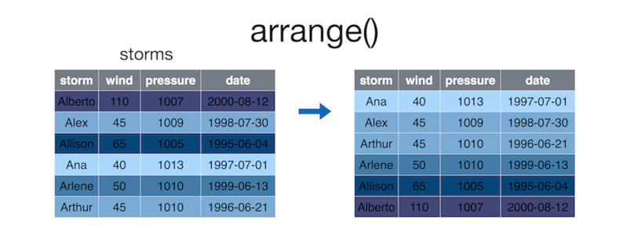

# Module 10: Introduction to DPLYR

The **`dplyr`** ("dee-ply-er") package is the preeminent tool for data wrangling in R (and perhaps, in data science more generally). It provides users with an intuitive vocabulary for executing data management and analysis tasks. Learning and utilizing this package will make your data preparation and management process faster and easier to understand.

<!-- START doctoc generated TOC please keep comment here to allow auto update -->
<!-- DON'T EDIT THIS SECTION, INSTEAD RE-RUN doctoc TO UPDATE -->
**Contents**

- [Resources](#resources)
- [A Grammar of Data Manipulation](#a-grammar-of-data-manipulation)
- [Data Frame Manipulation](#data-frame-manipulation)
  - [Select](#select)
  - [Filter](#filter)
  - [Mutate](#mutate)
  - [Arrange](#arrange)
  - [Summarise](#summarise)
  - [Distinct](#distinct)
- [Pipe Operator](#pipe-operator)
  - [Nested Operations](#nested-operations)
  - [Pipe Operator Syntax](#pipe-operator-syntax)
- [Grouped Operations](#grouped-operations)
- [Joins](#joins)
  - [DPLYR Joins,](#dplyr-joins)
- [Non-standard Evaluation](#non-standard-evaluation)

<!-- END doctoc generated TOC please keep comment here to allow auto update -->

## Resources
- [Introduction to dplyr](https://cran.r-project.org/web/packages/dplyr/vignettes/introduction.html)
- [dplyr and pipes: the basics (blog)](http://seananderson.ca/2014/09/13/dplyr-intro.html)
- [Two-table verbs](https://cran.r-project.org/web/packages/dplyr/vignettes/two-table.html)
- [DPLYR Join Cheatsheet (Jenny Bryan)](http://stat545.com/bit001_dplyr-cheatsheet.html)
- [Non-standard evaluation](https://cran.r-project.org/web/packages/dplyr/vignettes/nse.html)
- [Data Manipulation with DPLYR (R-bloggers)](https://www.r-bloggers.com/data-manipulation-with-dplyr/)
- [Data Manipulation in R (DataCamp)](https://www.datacamp.com/courses/dplyr-data-manipulation-r-tutorial)

## A Grammar of Data Manipulation
[Hadley Wickham](http://hadley.nz/), the creator of the [`dplyr`](https://github.com/hadley/dplyr) package, fittingly refers to it as a ___Grammar of Data Manipulation___.

This is because the package provides a set of **verbs** (functions) to that describe and perform common data preparation tasks. One of the core challenge in programming is _mapping_ from questions about a dataset to specific programming operations. The presence of a data manipulation grammar makes this process smoother, as it enables us to use the same vocabulary to both _ask_ questions and _write_ our program. Specifically, the `dplyr` grammar lets us to easily talk about and perform task such as:

- **select** specific features (columns) of interest from the data set
- **filter** out irrelevant data and only keep observations (rows) of interest
- **mutate** a data set by adding more features (columns)
- **arrange** the observations (rows) in a particular order
- **summarize** the data in terms of aspects such as the mean, median, or maximum
- find **distinct** observations (rows) in the data set
- **join** multiple data sets together into a single data frame

You can use these words when describing the _algorithm_ or process for interrogating data, and then use `dplyr` to write code that will closely follow your "plain language" description because it uses functions and procedures that share the same language. Indeed, many real-world questions about a dataset come down to isolating specific rows/columns of the data set as the "elements of interest", and then performing a simple comparison or computation (mean, count, max, etc.). While it is possible to perform this computation with base R code&mdash;the `dplyr` library makes it much easier to write and read such code.

<!-- Refactor this into Module 9 probably -->
To practice asking questions about datasets using these questions but ___without___ `dplyr`, see [exercise-1](exercise-1).

## Using `dplyr` Functions
The `dplyr` package provides functions that mirror the above verbs. Using this package's functions will allow you to quickly and effectively write code to ask questions of your data set.

Since `dplyr` is an external package, you will need to install it (once per machine) and load it to make the functions available:

```r
install.packages("dplyr")  # once per machine
library("dplyr")
```

After loading the library, you can call any of the functions just as if they were the built-in functions you've come to know and love.

For each `dplyr` function discussed here, the **first argument** to the function is a data frame to manipulate, with the rest of the arguments providing more details about the manipulation.

- ___IMPORTANT NOTE:___ inside the function argument list (inside the parentheses), we refer to data frame columns **without quotation marks**&mdash;that is, we just give the column names as _variable names_, rather than as _character strings_. This is refered to as [non-standard evaluation](#Non-standard Evaluation), and is described in more detail below; while it makes code easier to write and read, it can occassionally create challenges.

<small>The images in this section come from the [RStudio's STRATA NYC R-Day workshop](http://bit.ly/rday-nyc-strata15), which was presented by [Nathan Stephens](http://conferences.oreilly.com/strata/big-data-conference-ny-2015/public/schedule/speaker/217840).</small>

### Select
The **`select()`** operation allows you to choose and extract **columns** of interest from your data frame.


```r
# Select `storm` and `pressure` columns from `storms` data frame
storm.info <- select(storms, storm, pressure)
```

The `select()` function takes in the data frame to select from, followed by the names of the columns you wish to select (without quotation marks!)

This function is equivalent to simply extracting the columns:

```r
# extract columns by name
storm.info <- storms[, c("storm", "pressure")]  # Note the comma!
```

But easier to read and write!

### Filter
The **`filter()`** operation allows you to choose and extract **rows** of interest from your data frame (contrasted with `select()` which extracts _columns_).


```r
# Select rows whose `wind` column is greater than or equal to 50
some.storms <- filter(storms, wind >= 50)
```

The `filter()` function takes in the data frame to filter, followed by a comma-separated list of conditions that each _row_ returned row must fill. Note again that columns are provided without quotation marks!
-  R will extract the rows that match **all** conditions. Thus you are specifying that you want to filter down a data frame to contain only the rows that meet Condition 1 **and** Condition 2.

This function is equivalent to simply extracting the rows:

```r
# extract rows by condition
some.storms <- storms[storms$wind >= 50, ]  # Note the comma!
```

### Mutate
The **`mutate()`** operation allows you to create additional **columns** for your data frame.


```r
# Add `ratio` column that is ratio between pressure and wind
storms <- mutate(storms, ratio = pressure/wind)  # Replace existing frame with mutated one!
```

The `mutate()` function takes in the data frame to mutate, followed by a comma-separated list of columns to create using the same **`name = vector`** syntax we used when creating **lists** or **data frames** from scratch. As always, the names of the columns in the data frame are used without quotation marks.
- Despite the `mutate()` function doesn't actually change the data frame; instead it returns a _new_ data frame that has the extra columns added. You will often want to replace the old data frame variable with this new value.

In cases where you are creating multiple columns (and therefore writing really long lines of code), you should break the single statement into multiple lines for readability. Because you haven't closed the parentheses on the function parameters, R will not treat each line as a separate statement.

```r
# Generic mutate command
more.columns <- mutate(my.data.frame,
                       new.column.1 = old.column * 2,
                       new.column.2 = old.column * 3,
                       new.column.3 = old.column * 4
                      )
```

### Arrange
The **`arrange()`** operation allows you to **sort the rows** of your data frame by some feature (column value).



```r
# Arrange storms by INCREASING order of the `wind` column
sorted.storms <- arrange(storms, wind)
```

By default, the `arrange()` function will sort rows in **increasing** order. To sort in **reverse** (decreasing) order, place a minus sign (**`-`**) in front of the column name (e.g., `-wind`). You can also use the `desc()` helper function (e.g, `desc(wind)`).
- You can pass multiple arguments into the `arrange()` function in order to sort first by `argument.1`, then by `argument.2`, and so on.
- Again, this doesn't actually modify the argument data frame&mdash;instead returning a new data frame you'll need to store.

<!-- ### Distinct
The **`distinct()`** operation allows you to extract distinct values (rows) from a particular **column** in your data frame&mdash;that is, you'll get one row for each different value in the column. If multiple columns are specified, you will get a row for each different combination.

For example (no diagram available):

```r
# Create a quick data frame
x <- c(1, 1, 2, 2, 3, 3, 4, 4)  # duplicate x values
y <- 1:8                        # unique y values
my.df <- data.frame(x, y)

# Select distinct rows, judging by the `x` column
distinct.rows <- distinct(my.df, x)
                                    #   x
                                    # 1 1
                                    # 2 2
                                    # 3 3
                                    # 4 4

# Select distinct rows, judging by the `x` and `y`columns
distinct.rows <- distinct(my.df, x, y)  # returns whole table, since no duplicate rows
```

While this is a simple way to get a unique set of rows, **be careful** not to unintentionally remove rows of your data which may be important. -->

### Summarize
The **`summarize()`** function (equivalently `summarise` for those using the British spelling) will generate a new data frame that contains a "summary" of a **column**, computing a single value from the multiple elements in that column.


```r
# Compute the median value of the `amount` column
summary <- summarize(pollution, median = median(amount))
```

The `summarize()` function takes in the data frame to mutate, followed by the values that will be included in the resulting summary table. You can use multiple arguments to include multiple summaries in the same statement:

```r
# Compute statistics for the `amount` column
summaries <- summarize(pollution,
                       median = median(amount),  # median value
                       mean = mean(amount),      # "average" value
                       sum = sum(amount),        # total value
                       count = n()               # number of values (neat trick!)
                       )
```

Note that the `summarize()` function is particularly useful for grouped operations (see below), as you can produce summaries of different groups of data.

To practice asking questions about datasets _with_ `dplyr`, see [exercise-2](exercise-2). For a more involved example, see [exercise-4](exercise-4).


## Multiple Operations
<!-- This discussion may be better for lecture than module, but leave in for now -->
You've likely encountered a number of instances in which you want to take the results from one function and pass them into another function. Our approach thus far has often been to create _temporary variables_ for use in our analysis. For example, if you're using the `mtcars` dataset, you may want to ask a simple question like,

> Which 4-cylinder car gets the best milage per gallon?

This simple question actually requires a few steps:

1. _Filter_ down the dataset to only 4 cylinder cars
2. Of the 4 cylinder cars, _filter_ down to the one with the highest mpg
3. _Select_ the car name of the car

You could then implement each step as follows:

```r
# Preparation: add a column that is the car name
mtcars.named <- mutate(mtcars, car.name = row.names(mtcars))

# 1. Filter down to only four cylinder cars
four.cyl <- filter(mtcars.named, cyl == 4)

# 2. Filter down to the one with the highest mpg
best.four.cyl <- filter(four.cyl, mpg == max(mpg))

# 3. Select the car name of the car
best.car.name <- select(best.four.cyl, car.name)
```

While this works fine, it clutters our work environment with variables we won't need to use again, and which can potentially step on one anothers toes. It can help with readability (the results of each step is complete), but those extra variables make it harder to modify and change the algorithm later.

An alternative to saving each step as a distinct variable would be to write the desired statements **nested** within other statements. For example, we could write the statement above as follows:

```r
# Preparation: add a column that is the car name
mtcars.named <- mutate(mtcars, car.name = row.names(mtcars))

# Write a nested operation to return the best car name
best.car.name <- select(  # 3. Select car name of the car
                  filter(  # 2. Filter down to the one with the highest mpg
                    filter( # 1. Filter down to only four cylinder cars
                      mtcars.named,  # parameters for the Step 1 filter
                      cyl == 4
                    ),
                    mpg == max(mpg)  # other parameters for the Step 2 filter
                  ),
                  car.name  # other parameters for the Step 3 select
                )
```

This version uses **anonymous variables**&mdash;result values which we don't give names to (so are anonymous), but instead immediately use as the arguments to another function. We've used these frequently with the `print()` function and with filters (those vectors of `TRUE` and `FALSE` values), and even the `max(mpg)` in Step 2 above is an anonymous variable!

This _nested_ version performs the same results as the _temporary variable_ version without creating the extra variables, but even with only 3 steps it can get quite complicated to read&mdash;in a large part because you have to think about it "inside out", with the stuff in the middle evaluating first.

This will obviously become undecipherable for more involved operations. Luckily, the pipe operator will provide us with a more clean (and cleaver) way of achieving the above task.

### The Pipe Operator
Luckily, `dplyr` provides a cleaner and effective way of achieving the same task (that is, using the result of one function as a parameter to the next). The **Pipe Operator** (**`>%>`**) indicates that the result from the first function operand should be passed in as **the first argument** to the next function operand!

As a simple example:
```r
# nested version: evaluate c(), then max(), then print()
print( max( c(2, 0, 1) ) )

# pipe version
c(1,2,3) %>%   # do first function
  max() %>%   # which becomes the _first_ argument to the next function
  print()  # which becomes the _first_ argument to the next function
```

Or as another version of the above data wrangling:

```r
# Preparation: add a column that is the car name
mtcars.named <- mutate(mtcars, car.name = row.names(mtcars))

best.car.name <- filter(mtcars.named, cyl == 4) %>%  # Step 1
  filter(four.cyl, mpg == max(mpg)) %>%  # Step 2
  select(best.four.cyl, car.name)
```

- Yes, the `%>%` operator is awkward to type and takes some getting use to (especially compared to the command-line's use of `|` to pipe). However, you can ease typing either by noticing that you hold down the `shift` key for all 3 characters, or by using the [RStudio keyboard shortcut](https://support.rstudio.com/hc/en-us/articles/200711853-Keyboard-Shortcuts) `cmd + shift + m`.

The pipe operator is part of the `dplyr` package (it is only available if you load that package), but it will work with _any_ function, not just `dplyr` ones! This syntax, while slightly odd, can complete change and simply the way you write code to ask questions about your data!

For an introduction to and practice working with the pipe operator, see [exercise-3](exercise-3).


## Grouped Operations
`dplyr` functions are powerful, but they are truly awesome when you can apply them to **groups of rows** within a data set. For example, the above use of `summarize()` isn't particularly useful since it just gives a single summary for a given column (which we could have done anyway). However, a **grouped** operation would allow us to compute the same summary measure (`mean`, `median`, `sum`, etc.) automatically for multiple groups of rows, enabling us to ask more nuanced questions about our data set.

The **`group_by()`** operation allows you to break a data frame down into _groups_ of rows, which can then have the other verbs (e.g., `summarize`, `filter`, etc). applied to each one.


```r
city.summary <- group_by(pollution, city) %>%
  summarize( # first parameter (the data frame) is recieved from the pipe
    mean = mean(amount),
    sum = sum(amount),
    n = n()
  )
```

As another example, if you were using the `mtcars` dataset, you may want to answer this question:

> What are the differences in mean miles per gallon for cars with different numbers of gears (3, 4, or 5)?

This simple question requires computing the mean for different subsets of the data. Rather than explicitly breaking your data into different groups (a.k.a bins or chunks) and running the same operations on each, you can use the `group_by()` function to accomplish this in a single command:

```r
# Group cars by gear number, then compute the mean and median mpg
gear.summary <- group_by(mtcars, gear) %>%  # group by gear
                 summarise(mean = mean(mpg))  # calculate mean
# computing the difference between scores is done elsewhere (or by hand!)
```

Thus grouping can allow you to quickly and easily compare different subsets of your data!

For an introduction to and practice working with grouped operations, see [exercise-5](exercise-5).


## Joins
When working with real-world data, you'll often find that that data is stored across _multiple_ files or data frames. This can be done for a number of reasons. For one, it can help to reduce memory usage (in the same manner as **factors**): for example, if we had a data frame containing information on students enrolled in university courses, we might store information about each course (the professor, meeting time, and classroom) in a separate data frame rather than duplicating that information for every student that takes the same course. We also may simply want to keep our information organized: have student information in one file, and course information in another.

- This separation and organization of data is a core concern in the design of [relational databases](https://en.wikipedia.org/wiki/Relational_database); check out the iSchool's Database courses for more information!

But at some point, we'll want to access information from both data sets (e.g., we need to figure out a student's schedule), and thus need a way to combine the data frames. This process is called a **join** (because we are "joining" the data frames together). When we perform a join, we identify **columns** which are present in both tables. Those column values are then used as **identifiers** to determine which rows in each table correspond to one another, and thus will be combined into a row in the resulting joined table.

The **`left_join()`** operation is one example of a join. This operation looks for matching columns between the two data frames, and then returns a new data frame that is the first ("left") operand with extra columns from the second operand added on.


```r
left_join(songs, artists)
```

To understand how this works, consider a specific example where we have a table of student ids and their contact information. We also have a separate table of student ids and their majors (your institution very well may store this information in separate tables for privacy or organizational reasons).

```r
# Table of contact information
student.contact <- data.frame(
    student.id = c(1, 2, 3, 4),  # id numbers
    email = c("id1@school.edu", "id2@school.edu", "id3@school.edu", "id4@school.ed")
)

# Table of information about majors
student.majors <- data.frame(
  student.id = c(1, 2, 3),  # id numbers
  major = c('sociology', 'math', 'biology')
)
```

Notice that both tables have a `student.id` column, allowing us to "match" the rows from the `student.contact` table to the `student.majors` table and merge them together:

```r
# Join tables by the student.id column
merged.student.info <- left_join(student.contact, student.majors)
                        #    student.id          email     major
                        # 1          1 id1@school.edu sociology
                        # 2          2 id2@school.edu      math
                        # 3          3 id3@school.edu   biology
                        # 4          4  id4@school.ed      <NA>
```

When we perform this **left join**, R goes through each row in thetable on the "left" (the first parameter), looking at the shared column (`student.id`). For each row, it looks for a corresponding value in `student.majors$student.id`, and if it fines one then it adds any data from columns that are in `student.majors` but _not_ in `student.contact` (e.g., `major`) to new columns in the resulting table, with values from whatever the matching row was. Thus student \#1 was given a `major` of "sociology", student \#2 was given a `major` of "math", and student \#4 was given a `major` of `NA` (because that student had no corresponding row in `student.majors`!)

- In short, a **left join** returns all of the rows from the first table, along with all of the columns from both tables.

R will join tables by any and all shared columns. However, if the names of your columns don't match specifically, you can also specify a `by` argument indicating which columns should be used for the matching:

```r
# Use the named `by` parameter to specify (a vector of) columns to match on
left_join(student.contact, student.majors, by="student.id")  # column name IS a string here!
```

Notice that because of how we've described a left join, **the order matters!!**. The resulting table only has rows for elements in the _left_ (first) table; any unmatched elements in the second table are lost. If you switch the order of the operands, we would only have information for students with majors:

```r
# Join tables by the student.id column
merged.student.info <- left_join(student.majors, student.contact)  # switched order!
                        #   student.id     major          email
                        # 1          1 sociology id1@school.edu
                        # 2          2      math id2@school.edu
                        # 3          3   biology id3@school.edu
```

We don't have any information for student \#4, because they didn't have a record in the left-hand table!

Because of this behavior, `dplyr` (and relational database systems in general) provide a number of different kinds of joins, each of which influences _which_ rows are included in the final table. Note that in any case, _all_ columns from _both_ tables will be included, with rows taking on any values from their matches in the second table.

- **`left_join`** All rows from the first (left) data frame are returned. That is, we get all the data from the left-hand table, with extra column values added from the right-hand table. Left-hand rows without a match will have `NA` in the right-hand columns.

- **`right_join`** All rows from the second (right) data frame are returned. That is, we get all the data from the right-hand table, with extra column values added from the left-hand table. Right-hand rows without a match will have `NA` in the left-hand columns. This is the "opposite" of a `left_join`, and the equivalent of switching the operands.

- **`inner_join`** Only rows in **both** data frames are returned. That is, we get any rows that had matching observations in both tables, with the column values from both tables. There will be no additional `NA` values created by the join. Observations from the left that had no match in the right, or observations in the right that had no match in the left, will not be returned at all.

- **`full_join`** All rows from **both** data frames are returned. That is, we'll get a row for any observation, whether or not it matched. If it happened to match we'll have values from both tables in that row. Observations without a match will have `NA` in the columns from the other table.

The key to deciding between these is to think about what set of data you want as your set of observations, and which columns you'd be okay with being `NA` if a record is missing.

Note that these are all _mutating joins_, which add columns from one table to another. `dplyr` also provides _filtering joins_ which exclude rows based on whether they have a matching observation in another table, and _set operations_ which combine observations as if they were set elements. See [the documentation](https://cran.r-project.org/web/packages/dplyr/vignettes/two-table.html) for more detail on these options, but in this class we'll be primarily focusing on the mutating joins described above.

For an introduction to and practice working with joins, see [exercise-6](exercise-6).


## Non-Standard Evaluation vs. Standard Evaluation
One of the features that makes `dplyr` such a clean and attractive way to write code is that inside of each function, we've been able to write column variable names **without quotes**. This is called [**non-standard evaluation**](https://cran.r-project.org/web/packages/dplyr/vignettes/nse.html) (it is _not_ the _standard_ way that code is _evaluated_, or interpreted), and is useful primarily because of how it reduces typing (along with some other benefits when working with databases).

However, there are times when you want to use `dplyr` with **standard evaluation**: that is, you want to be able to specify column names as normal _values_ (in quotes). Luckily, `dplyr` supplies a set of functions that support standard evaluation. These have the exact same names as the normal verb functions, except are followed by an underscore (**`_`**):

```r
# Normal, non-standard evaluation version
mpg <- select(mtcars, mpg)

# Standard-evaluation version (same result)
mpg <- select_(mtcars, 'mpg')  # with quotes! 'mpg' is a normal value!

# Normal, non-standard evaluation version of equations
mean.mpg <- summarize(mtcars, mean(mpg))

# Standard-evaluation version of equations (same result)
mean.mpg <- summarize_(mtcars, 'mean(mpg)')
```

- Yes, it does feel a bit off that the "normal" way of using `dplyr` is the "non-standard" way.

The most common use-case for this system is when you're storing the _name of a column of interest_ in a variable:

```r
# Which column you're interested in
which.column <- 'mpg'

# Use standard evaluation to execute function:
my.column <- select_(mtcars, which.column)
```

Because we're using standard evaluation, `which.column` isn't treated as the _name_ of the column (it's _not_ refering to `mtcars$which.column`, a.k.a. `mtcars[['which.column']]`), but is instead a normal variable which contains the name of the column in it (it _is_ referring to `mtcars[[which.column]]`)
